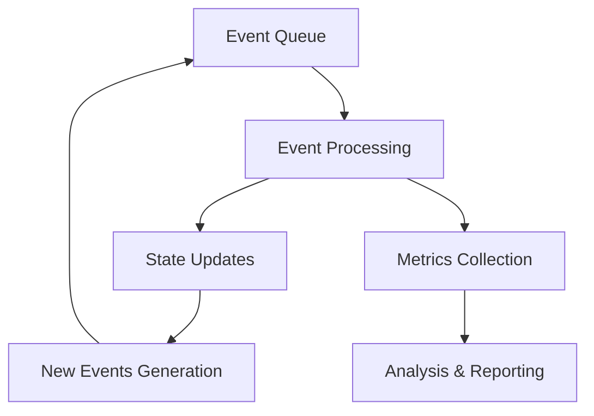

# Sharding Simulation Experiment

## Overview
This is a simulation of a sharded blockchain network that studies the impact of grinding attacks on the network's performance and security.

## Core Components

### 1. Network Structure
- The network consists of multiple shards (defined by `NumShards`)
- Each shard contains multiple nodes (both honest and malicious)
- Nodes can produce blocks within their assigned shard
- Total number of nodes is defined by `NumNodes`

### 2. Node Types
- **Honest Nodes**: Regular participants following protocol rules
- **Malicious Nodes**: Attackers trying to exploit the system
  - Ratio controlled by `MaliciousNodeRatio` (default 10%)
  - Have increased lottery attempts during attacks (`MaliciousNodeMultiplier`)

### 3. Shard Assignment Process
1. Nodes participate in a lottery system to join shards
2. Winning probability controlled by `LotteryWinProbability`
3. Shard assignment is determined by: `(nodeID + timestamp) % numShards`

### 4. Block Production
- Each shard produces blocks at regular intervals (`BlockProductionInterval`)
- Each block contains a fixed number of transactions (`TransactionsPerBlock`)
- Blocks maintain references to previous blocks within their shard

### 5. Network Communication
- Simulated network delay between nodes
- Delay follows normal distribution:
  - Mean: `NetworkDelayMean`
  - Standard deviation: `NetworkDelayStd`

## Event-Driven Architecture

### 1. Event System Overview
The simulation uses an event-driven architecture where all activities are modeled as events scheduled and processed in chronological order.

#### Core Event Types
- **LotteryEvent**: Triggers node participation in shard assignment lottery
- **ShardBlockProductionEvent**: Schedules block creation within shards
- **MessageEvent**: Handles network communication between nodes
- **AttackEvent**: Manages the execution of attacks
- **MetricsEvent**: Collects performance metrics at regular intervals

#### Event Queue Implementation
```go
type Event struct {
    Timestamp int64
    Type      EventType
    NodeID    int
    ShardID   int
    Data      interface{}
}

type EventQueue []*Event
```
- Uses a priority queue (min-heap) to maintain chronological order
- Events are processed based on their timestamps
- New events can be dynamically added during simulation

### 2. Event Processing Flow

#### a. Event Scheduling
1. **Initial Events**:
   - Block production events for each shard
   - First lottery event for node assignments
   - First metrics collection event
   - Attack events based on configuration

2. **Dynamic Events**:
   - Message events for block propagation
   - Follow-up block production events
   - Periodic metrics collection

#### b. Event Processing Loop
```go
func (sim *Simulation) Run() {
    for !sim.EventQueue.IsEmpty() && sim.CurrentTime <= sim.Config.SimulationTime {
        e := heap.Pop(sim.EventQueue).(*event.Event)
        sim.CurrentTime = e.Timestamp
        sim.processEvent(e)
    }
}
```

#### c. Event Handlers
1. **Lottery Handler**:
   - Processes node attempts to join shards
   - Schedules block production for winning nodes
   - Updates shard assignments

2. **Block Production Handler**:
   - Creates new blocks in shards
   - Broadcasts blocks to shard peers
   - Schedules message events for block propagation

3. **Message Handler**:
   - Processes block propagation
   - Updates node and shard states
   - Tracks network delays

4. **Attack Handler**:
   - Executes attack strategies
   - Modifies node behavior during attacks
   - Logs attack impacts

5. **Metrics Handler**:
   - Collects performance data
   - Records shard statistics
   - Tracks attack effectiveness

## Simulation Workflow

### 1. Initialization Phase
```go
func NewSimulation(cfg config.Config) *Simulation {
    sim := &Simulation{
        Config:            cfg,
        Nodes:             make(map[int]*node.Node),
        Shards:            make(map[int]*shard.Shard),
        EventQueue:        event.NewEventQueue(),
        Metrics:           metrics.NewMetricsCollector(),
        CurrentTime:       0,
        NextBlockProducer: make(map[int]int),
    }

    sim.initializeNodes()
    sim.initializeShards()
    sim.scheduleInitialEvents()

    return sim
}
```

### 2. Main Simulation Loop
1. **Time Advancement**:
   - Simulation progresses by processing events in timestamp order
   - Current time updates to each event's timestamp

2. **State Management**:
   - Tracks node assignments to shards
   - Maintains block production order
   - Records network communication

3. **Attack Integration**:
   - Activates during configured time windows
   - Modifies node behavior
   - Tracks attack impact

4. **Metrics Collection**:
   - Regular sampling of system state
   - Performance measurements
   - Attack effectiveness analysis

### 3. Data Flow


### 4. Simulation Termination
- Ends when queue is empty or simulation time is reached
- Generates comprehensive metrics report
- Provides data for visualization

This event-driven approach enables:
- Precise timing control
- Accurate network delay simulation
- Complex interaction modeling
- Detailed performance analysis
- Flexible attack scenario testing

## Simulation Flow

### 1. Initialization
1. Create configuration with parameters
2. Initialize shards
3. Create nodes (both honest and malicious)
4. Set up event queue for simulation

### 2. Main Loop
The simulation processes events in chronological order:
1. **Lottery Events**: Nodes attempt to join shards
2. **Block Production Events**: Shards create new blocks
3. **Message Events**: Network communication between nodes
4. **Attack Events**: Execution of grinding attacks
5. **Metrics Events**: Collection of performance data

### 3. Grinding Attack Mechanism
- Activates between `AttackStartTime` and `AttackEndTime`
- Malicious nodes get additional lottery attempts (`MaliciousNodeMultiplier`)
- Goal: Manipulate shard assignment process

### 4. Metrics Collection
Tracks various performance indicators:
- Transactions per second (TPS)
- Network latency
- Block production rates
- Malicious shard rotations
- Node distribution across shards

### 5. Analysis
The simulation generates a detailed report analyzing:
- System performance before, during, and after attacks
- Impact on transaction throughput
- Success rate of malicious shard rotations
- Network stability metrics

## Key Parameters

## Visualization
The simulation results are plotted using Python (plot.py):
1. TPS over time
2. Malicious shard rotations
3. Network latency trends

[To be continued with more technical details...]
